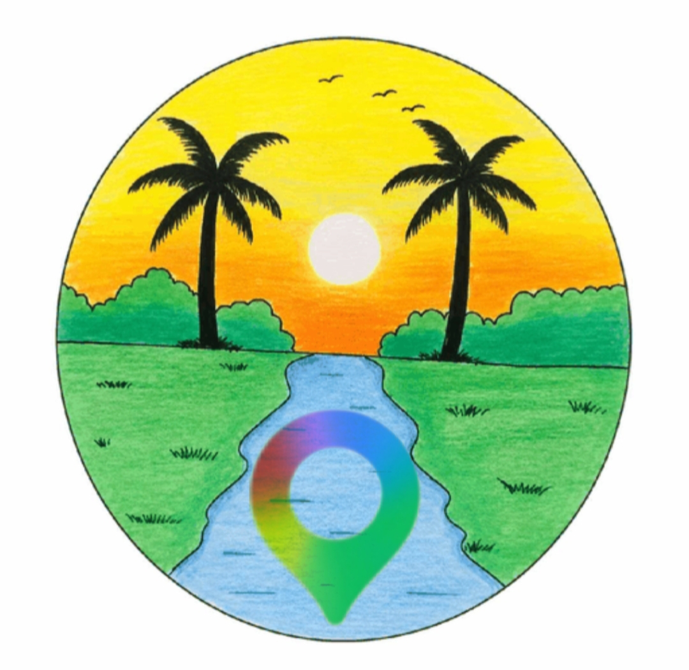

<!DOCTYPE html>
<html lang="ar" dir="rtl">
<head>
  <meta charset="UTF-8">
  <meta name="viewport" content="width=device-width, initial-scale=1.0, maximum-scale=1.0, user-scalable=no">

  <title>Alislamiah Maps</title>

  <link rel="icon" href="icon.png" type="image/png">

  <!-- Leaflet -->
  <link
    rel="stylesheet"
    href="https://unpkg.com/leaflet@1.9.4/dist/leaflet.css"
  />

  
</head>

<body>

  <!-- الخريطة -->
  

  <!-- المنطقة العلوية -->
  

    

      <button class="menu-btn" id="menuBtn" aria-label="القائمة">
        ☰
      </button>

      

        ⌕

        <input
          id="searchInput"
          type="search"
          placeholder="ابحث عن مكان أو عنوان..."
          autocomplete="off"
        >

        <button class="clear-btn" id="clearBtn">×</button>

      

    

    

  

  <!-- شعار Alislamiah -->
  

    
    Alislamiah Maps
  

  <!-- أدوات الخريطة -->
  

    <button class="control-btn" id="locationBtn" title="موقعي">
      ◎
    </button>

    <button class="control-btn" id="zoomIn" title="تكبير">
      +
    </button>

    <button class="control-btn" id="zoomOut" title="تصغير">
      −
    </button>

  

  <!-- بطاقة المكان -->
  

    

      

        📍
      

      

        

          الموقع
        

        

          اختر مكانًا من الخريطة
        

      

      <button class="close-card" id="closeCard">
        ×
      </button>

    

    

      <button class="action-btn primary" id="directionsBtn">
        🧭 الاتجاهات
      </button>

      <button class="action-btn" id="shareBtn">
        ↗ مشاركة
      </button>

    

  

  <!-- رسالة الحالة -->
  

  <!-- شريط التنقل -->
  <nav class="bottom-nav">

    <button class="nav-item active" id="homeNav">
      ⌂
      الخريطة
    </button>

    <button class="nav-item" id="exploreNav">
      ✦
      استكشاف
    </button>

    <button class="nav-item" id="savedNav">
      ♡
      المحفوظات
    </button>

    <button class="nav-item" id="settingsNav">
      ⚙
      الإعدادات
    </button>

  </nav>

  <!-- Leaflet -->
  

  

</body>
</html>